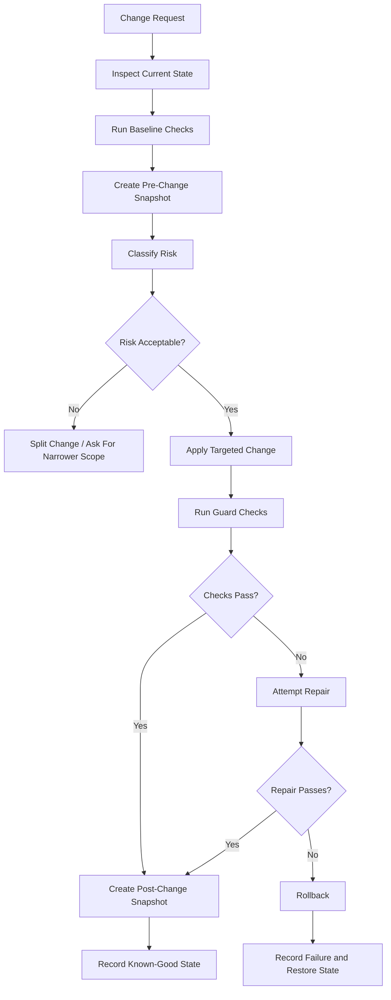

# AUTO SNAPSHOT AND CHANGE GUARD

**Document Type:** Project Guardrail / Implementation Safety Protocol  
**Project:** Caleb AI  
**Applies To:** Caleb AI Hollow Server MVP, Solomon’s Forge workflows, Codex implementation passes, future app-building pipelines  
**Purpose:** Preserve every known-working state before changes, enable deterministic rollback, and reduce the chance that implementation changes break the app in the first place.

---

## 0. Core Principle

Caleb AI must never treat a working app state as disposable.

Before implementation changes are applied, the system must preserve the current working state, record what is being changed, run safety checks, and maintain a clear rollback path.

The operating rule is:

> **Every change begins from a recoverable snapshot. Every risky change passes through a guard. Every failure has a rollback path.**

Expanded principle:

> **Do not rely on memory, hope, or model confidence to preserve working logic. Capture the working state first, then change deliberately.**

---

## 1. Why This Exists

AI-assisted coding can move fast, but fast changes create recurring failure patterns:

- Working logic gets accidentally removed.
- Event handlers disappear during rewrites.
- State fields are renamed without updating dependent code.
- Test coverage is skipped because the app “looks simple.”
- New features are added by replacing too much code at once.
- A fix for one issue breaks a previously working path.
- Rollback becomes difficult because the last known-good state was not captured.

The Auto Snapshot and Change Guard exists to prevent these failures.

This document establishes a system-level rule:

> **No implementation pass should mutate the app without first preserving a rollback-ready snapshot of the working state.**

---

## 2. Non-Negotiable Rules

### Rule 1 — Snapshot Before Mutation

Before any code, config, schema, test, or workflow file is changed, the current state must be snapshotted.

Minimum trigger:

- Any source code modification
- Any dependency change
- Any schema change
- Any test change that could mask failures
- Any refactor
- Any file move or rename
- Any generated replacement of a module
- Any change requested by a model or implementation agent

Correct pattern:

```text
Inspect current state.
Create snapshot.
Record snapshot metadata.
Apply change.
Run guards.
Commit or rollback.
```

Incorrect pattern:

```text
Apply change first.
Hope the previous state can be reconstructed later.
```

---

### Rule 2 — Preserve Working Logic, Not Just Files

A snapshot must preserve enough context to restore behavior, not merely raw text.

The snapshot should capture:

- Files changed
- Full file contents or file hashes with recoverable backup copies
- Current package/dependency state
- Test status before change
- Known working commands
- Current app behavior summary
- Reason the change was requested
- Risk level of the change
- Rollback instructions

A snapshot is only useful if it can restore the app to the previous working behavior.

---

### Rule 3 — Small Changes Beat Large Rewrites

When possible, implementation should use targeted patches instead of full-file rewrites.

Allowed:

- Replace a single function.
- Add a focused module.
- Patch a handler.
- Add a test for the changed behavior.
- Extend an existing type carefully.

High-risk:

- Rewrite an entire file to make one small change.
- Rebuild a component from memory.
- Rename state across many files without automated checks.
- Replace working logic with a simplified version.
- Remove code because it appears unused without proof.

If a full rewrite is unavoidable, it requires a higher guard level and explicit preservation checks.

---

### Rule 4 — Rollback Must Be Mechanical

Rollback should not depend on a model reconstructing old logic.

Rollback must be possible by restoring snapshot files or applying a recorded reverse patch.

Rollback instructions must be clear enough for a human, Codex, or future Hollow to execute.

Minimum rollback metadata:

```json
{
  "snapshot_id": "snap_001",
  "created_at": "ISO_TIMESTAMP",
  "reason": "Before implementing change request",
  "changed_files_planned": [],
  "restore_method": "restore_snapshot_files",
  "snapshot_location": ".caleb/snapshots/snap_001",
  "verification_command": "npm test && npm run typecheck"
}
```

---

### Rule 5 — Tests Must Protect Existing Behavior

A change is not complete merely because the new feature works.

A change is complete only when:

- Existing tests still pass.
- New or changed behavior is covered.
- Critical workflows are smoke-tested.
- Placeholder/stub detection passes.
- Typecheck passes.
- No unrelated logic was removed.

The guard must ask:

> **What was working before, and did this change preserve it?**

---

## 3. Snapshot Types

### 3.1 Pre-Change Snapshot

Created before any mutation.

Purpose:

- Preserve the exact current state.
- Enable rollback if implementation fails.
- Record what the app looked like before the change.

Required for every implementation change.

---

### 3.2 Post-Change Snapshot

Created after successful implementation and validation.

Purpose:

- Mark a new known-good state.
- Preserve the working result of a successful pass.
- Create a stable base for the next pass.

Required when:

- Tests pass.
- Typecheck passes.
- The intended behavior works.
- No critical guard failures remain.

---

### 3.3 Emergency Snapshot

Created when the system detects a broken state but before attempting repair.

Purpose:

- Preserve the broken state for diagnosis.
- Avoid destroying evidence while fixing.
- Support defect analysis.

Emergency snapshots should be labeled clearly:

```text
snap_014_emergency_broken_export_path
```

---

### 3.4 Milestone Snapshot

Created after major project milestones.

Examples:

- Hollow Registry working
- Verified Return Path working
- Ledger writing entries
- First workflow passing end-to-end
- UI MVP stable
- Export pipeline stable

Milestone snapshots are long-term restore anchors.

---

## 4. Snapshot Storage Shape

Recommended local-first structure:

```text
.caleb/
├── snapshots/
│   ├── snap_0001_pre_change/
│   │   ├── manifest.json
│   │   ├── files/
│   │   ├── patch.diff
│   │   ├── test-status-before.json
│   │   └── notes.md
│   ├── snap_0002_post_change/
│   │   ├── manifest.json
│   │   ├── files/
│   │   ├── patch.diff
│   │   ├── test-status-after.json
│   │   └── notes.md
│   └── milestones/
├── change-guard/
│   ├── change-requests/
│   ├── risk-reports/
│   └── rollback-reports/
└── ledger/
    └── snapshots.jsonl
```

V1 may use plain filesystem folders and JSON files.

Later versions may use Git commits, SQLite, signed manifests, Merkle logs, or content-addressed storage.

---

## 5. Snapshot Manifest

Each snapshot must include a manifest.

```json
{
  "snapshot_id": "snap_0001_pre_change",
  "snapshot_type": "pre_change",
  "created_at": "ISO_TIMESTAMP",
  "project": "caleb-ai",
  "branch": "local-or-git-branch-name",
  "reason": "Before implementing Auto Snapshot and Change Guard",
  "requested_change": "Add automatic snapshots and break-prevention guardrails",
  "risk_level": "medium",
  "files_captured": [
    {
      "path": "src/hollows/runner.ts",
      "hash": "sha256:...",
      "size_bytes": 12345
    }
  ],
  "commands_before": [
    {
      "command": "npm test",
      "status": "pass"
    },
    {
      "command": "npm run typecheck",
      "status": "pass"
    }
  ],
  "known_working_behaviors": [
    "Character Count Hollow runs through runner",
    "Verified Return Path accepts valid output",
    "Ledger writes invocation entry"
  ],
  "rollback_method": "restore_captured_files",
  "rollback_steps": [
    "Stop current implementation pass.",
    "Restore files from .caleb/snapshots/snap_0001_pre_change/files/.",
    "Run npm test.",
    "Run npm run typecheck.",
    "Record rollback result in ledger."
  ],
  "ledger_ref": "ledger_snapshot_0001"
}
```

---

## 6. Change Guard Workflow

Every implementation change should move through this workflow.



The system should prefer targeted repair once.

If repair fails, rollback should happen quickly instead of compounding damage with repeated guesses.

---

## 7. Risk Classification

Each change must be assigned a risk level before implementation.

| Risk | Meaning | Examples | Required Guard |
|---|---|---|---|
| Low | Local, narrow, unlikely to affect other systems | Copy change, small helper function, test text | Snapshot + test relevant path |
| Medium | Touches behavior or shared code | New Hollow, new schema, runner change | Snapshot + full tests + typecheck |
| High | Touches core architecture or many files | Registry, runner, ledger, orchestration, build config | Snapshot + full tests + typecheck + smoke test + diff review |
| Critical | Could destroy data or invalidate trust | File deletion, migration, auth, permissions, ledger mutation | Snapshot + human approval + dry run + rollback plan |

Default rule:

> If the system is unsure, classify the change one level higher.

---

## 8. Break-Prevention Gates

The Change Guard must run checks designed to prevent breaking the app.

### 8.1 Baseline Gate

Before changes:

- Run existing tests if available.
- Run typecheck if available.
- Record current failures honestly.
- Identify known-good workflows.
- Capture files in snapshot.

If baseline is already failing, mark the snapshot as:

```text
pre_change_unstable
```

Do not pretend it was clean.

---

### 8.2 Scope Gate

Before implementation, define the intended change scope.

The system should record:

- Files expected to change
- Files that must not change
- Behaviors that must be preserved
- Tests that should be added or updated
- Rollback method

A change that expands beyond its planned scope should pause and reclassify risk.

---

### 8.3 Dependency Gate

Before changing dependencies:

- Record current dependency versions.
- Explain why the dependency is needed.
- Prefer no new dependency unless necessary.
- Check whether existing project tools can handle the need.
- Snapshot lockfiles.

Dependency changes are at least medium risk.

---

### 8.4 Schema Gate

Before changing schemas:

- Record current schema version.
- Determine whether the change is breaking.
- Update fixtures.
- Update tests.
- Update manifest references.
- Preserve backward compatibility when possible.

Breaking schema changes require a version bump.

---

### 8.5 Logic Preservation Gate

After changes, inspect whether working logic was removed.

Checks should include:

- No unexpected deletion of exported functions.
- No dropped event handlers.
- No missing state fields.
- No removed validation gates.
- No skipped ledger writes.
- No bypassed Verified Return Path.
- No replacement of deterministic logic with model guessing.

This gate directly protects the Caleb AI architecture.

---

### 8.6 Placeholder Gate

No pass should finish with fake completion markers.

Blockers include:

- `TODO: implement later`
- `placeholder`
- `stub`
- `mock this later`
- Empty functions pretending to work
- Fake tests that assert `true`
- Comments replacing implementation

Placeholders may exist only if deliberately tracked as future work and not presented as complete.

---

### 8.7 Test Gate

After implementation:

- Run unit tests.
- Run typecheck.
- Run targeted smoke tests.
- Add regression tests for fixed bugs.
- Confirm old workflows still pass.

Suggested V1 command set:

```bash
npm test
npm run typecheck
npm run build
```

If a project does not yet have these scripts, the repository setup pass should add them.

---

### 8.8 Diff Review Gate

Before accepting a change, review the diff.

The review should answer:

- Did the change stay in scope?
- Were unrelated files modified?
- Was working logic removed?
- Were tests added or updated?
- Did any guardrail weaken?
- Does rollback remain possible?

For AI-assisted coding, diff review is mandatory because the model may accidentally simplify or omit logic.

---

## 9. Rollback Rules

Rollback is required when:

- The app no longer compiles.
- Typecheck fails after repair attempt.
- Tests fail and the failure is not understood.
- A core workflow breaks.
- A file is unexpectedly truncated.
- A Hollow bypasses schema validation.
- Ledger writes are skipped.
- Verified Return Path is bypassed.
- The change expands beyond safe scope.
- The implementation agent cannot explain what changed.

Rollback is not failure.

Rollback is disciplined preservation.

The rule is:

> **When the working state is at risk, restore first, analyze second.**

---

## 10. Snapshot Ledger Entries

Snapshots must be recorded in the Ledger.

Minimum snapshot ledger entry:

```json
{
  "ledger_id": "ledger_snapshot_0001",
  "timestamp": "ISO_TIMESTAMP",
  "task_id": "task_001",
  "run_id": "run_001",
  "actor_type": "change_guard",
  "actor_id": "auto_snapshot_guard",
  "actor_version": "1.0.0",
  "activity": "pre_change_snapshot_created",
  "snapshot_id": "snap_0001_pre_change",
  "snapshot_type": "pre_change",
  "input_digest": "sha256:...",
  "output_digest": "sha256:...",
  "status": "success",
  "trust_tier": "T3",
  "warnings": [],
  "errors": [],
  "parent_refs": [],
  "artifact_refs": [
    ".caleb/snapshots/snap_0001_pre_change"
  ]
}
```

Snapshot entries support the larger Caleb AI principle:

> The Ledger remembers what changed, why it changed, and how to restore what worked.

---

## 11. Recommended V1 Implementation Components

Add these modules when the project is ready to implement the guard.

```text
src/changeGuard/
├── snapshotManager.ts
├── snapshotManifest.ts
├── changeRisk.ts
├── guardRunner.ts
├── rollbackManager.ts
├── diffInspector.ts
└── changeGuardTypes.ts
```

Suggested test folder:

```text
src/tests/changeGuard/
├── snapshotManager.test.ts
├── changeRisk.test.ts
├── rollbackManager.test.ts
└── guardRunner.test.ts
```

Suggested docs:

```text
docs/AUTO_SNAPSHOT_AND_CHANGE_GUARD.md
docs/ROLLBACK_PROTOCOL.md
docs/CHANGE_RISK_CLASSIFICATION.md
```

---

## 12. First Change Guard Hollows

These Hollows can support the snapshot and break-prevention system.

| # | Hollow | Category | Purpose |
|---:|---|---|---|
| 1 | File Hash Hollow | Provenance | Verify captured file integrity. |
| 2 | Snapshot Manifest Validator Hollow | Validation | Ensure snapshot metadata is complete. |
| 3 | Diff Summary Hollow | Code | Summarize changed files and risk signals. |
| 4 | Placeholder Detector Hollow | Code | Catch stubs, TODOs, fake completion. |
| 5 | Export Surface Hollow | Code | Detect removed exports or changed public APIs. |
| 6 | Test Command Hollow | Validation | Run approved project test commands and normalize results. |
| 7 | Rollback Integrity Hollow | Provenance | Confirm snapshot can restore captured files. |
| 8 | Dependency Drift Hollow | Code | Detect package and lockfile changes. |

V1 does not need all of these immediately.

The minimum useful implementation is:

- Snapshot Manager
- File Hash support
- Snapshot Manifest validation
- Rollback Manager
- Guard Runner for approved commands

---

## 13. Codex Execution Order Addition

Add this as a new pass after the Ledger foundation exists, or earlier as a lightweight filesystem utility if Codex is actively making large changes.

### Pass 05.5 — Auto Snapshot and Change Guard

Tasks:

- Create snapshot manifest type.
- Implement Snapshot Manager.
- Capture selected files before mutation.
- Write snapshot metadata.
- Add file hashing for captured files.
- Add Rollback Manager.
- Add Guard Runner for approved commands.
- Record snapshot events in Ledger.
- Add tests for snapshot creation and rollback.

Definition of done:

- A pre-change snapshot can be created before implementation.
- Captured files can be restored mechanically.
- Snapshot manifest validates required metadata.
- Snapshot creation writes a Ledger entry.
- Rollback writes a Ledger entry.
- Tests prove that a modified file can be restored from snapshot.

Do not allow this pass to become a large UI project.

Keep it local, deterministic, and testable.

---

## 14. Codex Implementation Instruction

When Codex implements changes in Caleb AI, it should follow this instruction:

```text
Before modifying any existing project file, create a rollback-ready snapshot of the current working state.

The snapshot must include all files that may be changed, a manifest, file hashes, baseline command results when available, and rollback instructions.

After the change, run the approved guard commands, including tests and typecheck when available.

If validation passes, create a post-change known-good snapshot.

If validation fails and cannot be repaired safely in one focused pass, rollback to the pre-change snapshot and record the failure.

Do not replace working logic with simplified logic.
Do not remove existing handlers, schemas, ledger writes, validation gates, or tests unless the change explicitly requires it and the reason is recorded.
Do not leave placeholders or fake completion markers.
```

---

## 15. Solomon’s Forge Integration

In Solomon’s Forge, this becomes a standard implementation pass:

```text
FORGE CHANGE SAFETY PASS

1. Identify requested change.
2. Identify files likely to be touched.
3. Run baseline checks.
4. Create pre-change snapshot.
5. Classify risk.
6. Apply targeted change.
7. Run guard checks.
8. Review diff.
9. Create post-change snapshot if stable.
10. Rollback if unstable.
```

This pass should run before any feature, refactor, bug fix, or optimization pass.

---

## 16. Acceptance Criteria For Any Implementation Change

A change may be accepted only when the following are true:

- A pre-change snapshot exists.
- The change scope is recorded.
- The risk level is recorded.
- The implementation stayed within scope or scope expansion was recorded.
- Tests pass or known failures are documented.
- Typecheck passes when available.
- No critical workflow regressed.
- No placeholders were introduced.
- No required Caleb AI trust path was bypassed.
- Rollback remains possible.
- The Ledger records the change.

---

## 17. Closing Principle

Caleb AI is built around verified execution, local certainty, provenance, and disciplined orchestration.

The same philosophy must govern implementation.

The app itself must be protected by the same kind of evidence discipline it provides to the user.

> **Snapshot first. Change carefully. Verify honestly. Roll back cleanly.**

That is how the Forge keeps building without losing what already works.
