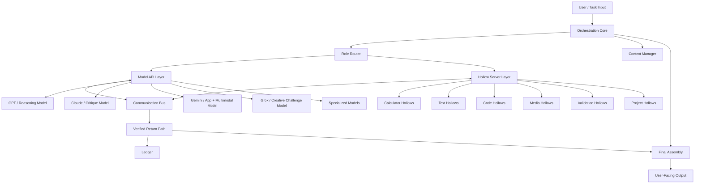
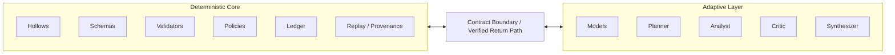
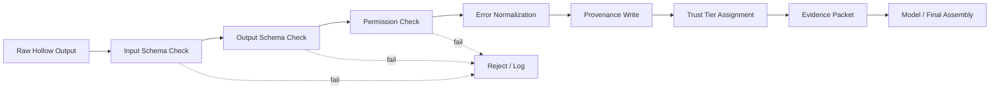
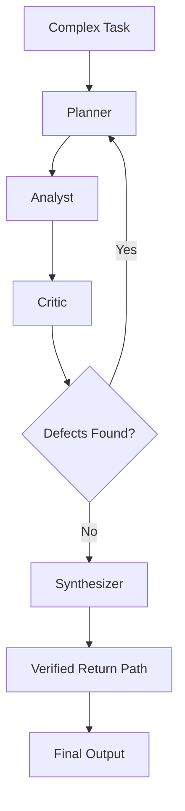
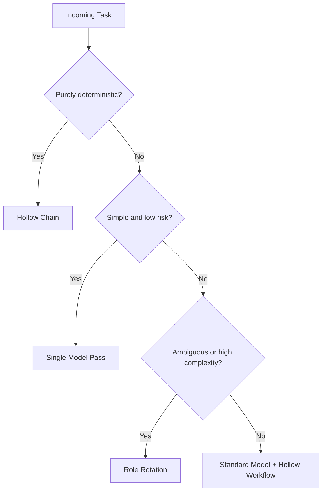
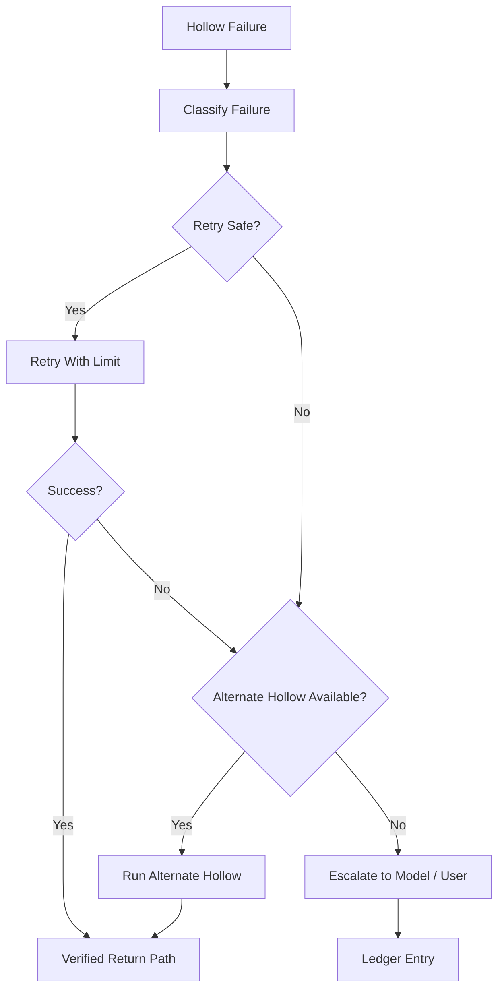

# CALEB AI EXECUTION BATTLEPLAN

**Document Type:** Project Source File / Build Manual / Codex Execution Plan  
**Project:** Caleb AI  
**Core Architecture:** Multi-Model Command Architecture with Hollow Server Agents and Role Rotation  
**Primary Builder:** Codex  
**Status:** Foundational battleplan for first implementation project  

---

## 0. North Star

Caleb AI is not a chatbot wrapper.

Caleb AI is a command architecture where AI models perform reasoning-heavy work, while local deterministic agents called **Hollows** perform repeatable logic, calculations, validation, inspection, transformation, and evidence generation.

The operating rule is:

> **Models think. Hollows work. Caleb orchestrates.**

Expanded principle:

> **The AI does not calculate what local logic can calculate. The AI commands the system that does the task, and rotates roles when deeper reasoning is needed.**

This project exists to build the practical foundation of Caleb AI in layers, starting with a small, provable Hollow Server runtime and expanding toward orchestration, role rotation, provenance, multi-model routing, and project-specific workflows.

---

## 1. What Caleb AI Is

Caleb AI is a structured execution environment with five major architectural planes:

1. **Orchestration Core**  
   Decides what should happen, which model or Hollow should handle it, whether role rotation is warranted, and how the final output is assembled.

2. **Model API Layer**  
   Connects to one or more AI models through APIs. Models are used for reasoning, planning, synthesis, critique, explanation, creative judgment, and interpretation.

3. **Hollow Server Layer**  
   Hosts local deterministic agents called Hollows. Hollows perform bounded, repeatable logic-driven operations.

4. **Communication Bus**  
   Moves structured messages between user input, Orchestration Core, model layer, Hollow Server, role rotation passes, validation gates, and final assembly.

5. **Verified Return Path / Ledger**  
   Ensures local outputs are schema-checked, provenance-stamped, logged, trust-rated, and safe to return to a model or user-facing answer.

---

## 2. What Caleb AI Is Not

Caleb AI is not:

- A single chatbot prompt.
- A loose collection of scripts.
- A generic agent swarm.
- A model-only reasoning loop.
- A pile of API calls without provenance.
- A system where the model freely invokes unrestricted local actions.
- A system where raw tool output is trusted without verification.

Every part must preserve separation of concerns:

- **Models reason.**
- **Hollows execute deterministic work.**
- **The Orchestration Core decides.**
- **The Ledger remembers.**
- **The Verified Return Path controls trust.**

---

## 3. Build Philosophy

The full Caleb AI vision is large. The first implementation must be small, strict, and provable.

Do not build the cathedral first.

Build the cornerstone:

> A local Hollow Server that can register deterministic Hollows, invoke them through typed contracts, validate their outputs, log provenance, and return verified evidence to a model or final assembly layer.

The first working proof does not need multi-model routing or full role rotation. It needs to prove the core claim:

> A model can delegate deterministic work to local Hollows and reason from verified local results instead of guessing.

---

## 4. Non-Negotiable Architecture Rules

### Rule 1 — Deterministic Work Goes Local

The model should not be used for:

- Character counting
- Word counting
- Duration math
- Aspect ratio math
- JSON validation
- Line counting
- Placeholder detection
- File hashing
- Prompt limit checks
- Basic arithmetic
- Schema conformance
- Repeatable rule checks

Those tasks belong to Hollows.

### Rule 2 — The Model May Request, But Orchestration Approves

Models may suggest Hollow calls, but they do not directly command unrestricted local execution.

Correct pattern:

```text
Model: I need character count and section balance.
Orchestration Core: Approves safe Hollow calls.
Hollow Server: Executes local Hollows.
Verified Return Path: Validates results.
Model: Reasons from verified evidence.
```

Incorrect pattern:

```text
Model directly executes arbitrary local code or file operations.
```

### Rule 3 — No Raw Hollow Output Becomes Trusted State

Every Hollow result must pass through the Verified Return Path before it can be used as evidence.

Minimum gates:

- Input schema validation
- Output schema validation
- Execution status check
- Error normalization
- Provenance write
- Trust classification
- Ledger reference

### Rule 4 — Every Hollow Is Versioned

Every Hollow must declare:

- `hollow_id`
- `name`
- `version`
- `category`
- `input_schema`
- `output_schema`
- `deterministic_level`
- `permissions_required`
- `status`

Breaking changes require version changes.

### Rule 5 — Role Rotation Is Conditional

Role Rotation is not the default path.

Use Role Rotation only when task complexity warrants it.

Triggers may include:

- Ambiguity
- High stakes
- Multi-step reasoning
- Conflicting evidence
- Large project planning
- Security-sensitive output
- Failure after initial reasoning
- Need for critique before final synthesis

Default flow should remain simple when the task is simple.

---

## 5. Core Vocabulary

| Term | Meaning |
|---|---|
| Caleb AI | The full command architecture. |
| Hollow Server | The local runtime that hosts and manages Hollows. |
| Hollow | A bounded deterministic local execution unit. |
| Hollow Server Agent | A Hollow treated as an invokable local worker. |
| Orchestration Core | The decision layer that routes work. |
| Model API Layer | The layer that connects external AI models. |
| Communication Bus | The structured message path between system parts. |
| Verified Return Path | The trust-controlled route by which Hollow results re-enter reasoning. |
| Ledger | Append-only provenance and execution memory. |
| Role Router | Chooses models, Hollows, and reasoning roles. |
| Role Rotation | Structured advanced reasoning through Planner, Analyst, Critic, Synthesizer. |
| Planner | Decomposes the task and identifies required evidence. |
| Analyst | Interprets evidence and builds candidate findings. |
| Critic | Finds weaknesses, missing checks, contradictions, and risk. |
| Synthesizer | Produces the final integrated answer or plan. |
| Deterministic Core | Hollows, schemas, validators, policies, provenance. |
| Adaptive Layer | AI models and structured reasoning roles. |
| Forge | The project-building and transformation environment. |

---

## 6. High-Level Architecture Diagram



---

## 7. Deterministic Core vs Adaptive Layer



The Deterministic Core should be strict, inspectable, replayable, and versioned.

The Adaptive Layer should be flexible, interpretive, creative, and reasoning-oriented.

---

## 8. V1 Goal

### V1 Name

**Caleb AI Hollow Server MVP**

### V1 Mission

Build a local-first Hollow Server runtime that proves deterministic delegation.

### V1 Success Statement

A user can submit a task containing text, code, or media metadata. The Orchestration Core routes deterministic checks to local Hollows. Hollows return structured verified evidence. The system logs the invocation in the Ledger and produces a user-facing report.

### V1 Does Not Need

- Full multi-model routing
- Full role rotation
- Production authentication
- Cloud deployment
- Complex UI
- Enterprise permissions
- Every project-specific Hollow

### V1 Must Include

- Hollow Registry
- Hollow Manifest format
- Hollow invocation runner
- Input/output schema validation
- Verified Return Path
- Ledger entries
- First 12 Hollows
- Basic report output
- Tests for every Hollow

---

## 9. Recommended V1 Tech Shape

Codex may choose exact implementation details, but the preferred first version should be simple and inspectable.

Recommended stack:

```text
Runtime: Node.js / TypeScript
Data store: local JSONL or SQLite
Schema validation: JSON Schema / Zod / TypeBox
Testing: Vitest or Jest
CLI: simple command interface first
UI: optional after core runtime works
```

Suggested repository shape:

```text
caleb-ai/
├── README.md
├── package.json
├── tsconfig.json
├── vitest.config.ts
├── docs/
│   ├── CALEB_AI_EXECUTION_BATTLEPLAN.md
│   ├── ARCHITECTURE.md
│   ├── HOLLOW_CONTRACT.md
│   ├── VERIFIED_RETURN_PATH.md
│   └── ROLE_ROTATION.md
├── src/
│   ├── index.ts
│   ├── orchestration/
│   │   ├── orchestrationCore.ts
│   │   ├── roleRouter.ts
│   │   └── finalAssembly.ts
│   ├── bus/
│   │   ├── messageBus.ts
│   │   └── envelopes.ts
│   ├── hollows/
│   │   ├── registry.ts
│   │   ├── manifest.ts
│   │   ├── runner.ts
│   │   ├── categories/
│   │   │   ├── text/
│   │   │   ├── code/
│   │   │   ├── media/
│   │   │   ├── validation/
│   │   │   └── provenance/
│   ├── verification/
│   │   ├── verifiedReturnPath.ts
│   │   ├── trustTiers.ts
│   │   └── schemaValidator.ts
│   ├── ledger/
│   │   ├── ledger.ts
│   │   └── ledgerTypes.ts
│   ├── reports/
│   │   └── reportBuilder.ts
│   └── tests/
│       ├── hollows/
│       ├── verification/
│       └── orchestration/
└── examples/
    ├── suno_prompt_check.json
    ├── code_guardrail_check.json
    └── media_duration_check.json
```

---

## 10. First 12 Hollows

These are the first Hollows to implement because they prove the core value quickly.

| # | Hollow | Category | Why It Comes First |
|---:|---|---|---|
| 1 | Character Count Hollow | Text | Prevents model guessing on text limits. |
| 2 | Prompt Limit Hollow | Text | Critical for Suno, image prompts, app protocols. |
| 3 | Section Balance Hollow | Text | Useful for lyrics, protocols, reports. |
| 4 | Repetition Scan Hollow | Text | Supports trope control and cleanup. |
| 5 | File Hash Hollow | Provenance | Foundation for artifact trust. |
| 6 | JSON Schema Validator Hollow | Validation | Foundation for contracts. |
| 7 | Line Count Hollow | Code | Critical for Gemini Canvas and single-file apps. |
| 8 | Placeholder Detector Hollow | Code | Catches TODOs, stubs, dropped logic. |
| 9 | Audio Duration Hollow | Media | Supports slideshow and export workflows. |
| 10 | Video Duration Hollow | Media | Supports mismatch detection. |
| 11 | Aspect Ratio Hollow | Media | Supports visual/video workflows. |
| 12 | Ledger Provenance Hollow | Provenance | Records what happened and why. |

---

## 11. Hollow Definition

A Hollow is:

> A bounded deterministic local execution unit inside the Hollow Server layer that accepts typed input, performs a repeatable operation, produces a structured result, writes provenance to the Ledger, and returns evidence through the Verified Return Path.

A Hollow may resemble a function, tool, microservice, validator, script, or local worker, but its role inside Caleb AI is specific:

> A Hollow removes deterministic burden from the Adaptive Layer and gives the Orchestration Core inspectable, replayable, locally executed evidence.

---

## 12. Hollow Manifest

Each Hollow must declare a manifest.

```json
{
  "id": "hollow.text.character_count",
  "name": "Character Count Hollow",
  "category": "text",
  "description": "Counts characters in provided text using deterministic local logic.",
  "version": "1.0.0",
  "schema_version": "1.0.0",
  "input_schema": "schemas/hollows/text/character-count.input.schema.json",
  "output_schema": "schemas/hollows/text/character-count.output.schema.json",
  "permissions_required": [],
  "file_access_scope": "none",
  "network_access": false,
  "deterministic_level": "strict",
  "heuristic_level": "none",
  "dependencies": [],
  "max_input_size": 100000,
  "max_runtime_ms": 1000,
  "supports_batching": true,
  "supports_streaming": false,
  "cache_policy": "content_hash",
  "test_suite": "tests/hollows/text/characterCount.test.ts",
  "owner": "caleb-ai-core",
  "status": "trusted",
  "safety_notes": "Pure text measurement. No side effects."
}
```

---

## 13. Hollow Invocation Contract

Every Hollow invocation should produce a structured record.

```json
{
  "hollow_id": "hollow.text.character_count",
  "hollow_name": "Character Count Hollow",
  "hollow_version": "1.0.0",
  "schema_version": "1.0.0",
  "invocation_id": "inv_001",
  "task_id": "task_001",
  "run_id": "run_001",
  "caller": "orchestration_core",
  "requested_by": "model_or_user",
  "approved_by": "role_router",
  "input_type": "text",
  "input_digest": "sha256:...",
  "input_payload": {
    "text_ref": "inline_or_artifact_ref"
  },
  "permissions": [],
  "execution_mode": "local_deterministic",
  "deterministic": true,
  "started_at": "ISO_TIMESTAMP",
  "completed_at": "ISO_TIMESTAMP",
  "status": "success",
  "result": {
    "character_count": 4812
  },
  "result_units": "characters",
  "checks": [
    "input_schema_valid",
    "output_schema_valid"
  ],
  "warnings": [],
  "errors": [],
  "artifact_hashes": [],
  "provenance": {
    "ledger_ref": "ledger_001"
  },
  "ledger_refs": ["ledger_001"],
  "retryable": false,
  "confidence_level": "exact",
  "verification_status": "verified"
}
```

---

## 14. Verified Return Path

The Verified Return Path is the controlled route by which Hollow results re-enter Caleb AI reasoning or final output.



The model should receive evidence packets, not uncontrolled raw output.

A good evidence packet includes:

- Hollow ID
- Hollow version
- Task ID
- Result summary
- Result details
- Units
- Warnings
- Errors
- Trust tier
- Ledger reference
- Whether it can be used for final output

---

## 15. Ledger Requirements

The Ledger is the system memory of what happened.

Minimum Ledger entry:

```json
{
  "ledger_id": "ledger_001",
  "timestamp": "ISO_TIMESTAMP",
  "task_id": "task_001",
  "run_id": "run_001",
  "actor_type": "hollow",
  "actor_id": "hollow.text.character_count",
  "actor_version": "1.0.0",
  "activity": "character_count",
  "input_digest": "sha256:...",
  "output_digest": "sha256:...",
  "status": "success",
  "trust_tier": "T2",
  "warnings": [],
  "errors": [],
  "parent_refs": [],
  "artifact_refs": []
}
```

Ledger entries must be append-only for V1.

V1 may use JSONL.

Later versions may use SQLite, Postgres, Merkle logs, signed entries, or W3C PROV-compatible export.

---

## 16. Trust Tiers

Suggested first trust model:

| Tier | Meaning |
|---|---|
| T0 | Raw untrusted output. |
| T1 | Schema-valid but not fully verified. |
| T2 | Verified deterministic Hollow output. |
| T3 | Verified output with provenance and policy clearance. |
| T4 | Human-approved or externally authoritative result with full provenance. |

Rule:

> If the model disagrees with a strict deterministic Hollow on a measurement, the Hollow wins.

Example:

```text
Model says: lyrics are under 5,000 characters.
Character Count Hollow says: 5,312 characters.
Final decision: Hollow result wins.
```

But heuristic Hollows do not automatically override judgment.

Example:

```text
TropeKill Hollow flags a phrase.
Model may decide the phrase is acceptable because of genre, context, or deliberate repetition.
```

---

## 17. Hollow Categories

### Calculator Hollows

Purpose: deterministic math and measurement.

Examples:

- Arithmetic
- Duration math
- BPM timing
- Aspect ratio conversion
- Inventory math
- Vendor minimums
- Pricing comparisons
- Unit conversion

### Text Hollows

Purpose: deterministic or rule-based text inspection.

Examples:

- Character count
- Word count
- Section count
- Repetition detection
- Prompt limit validation
- Banned word detection
- Section balance
- Trope detection

### Code Hollows

Purpose: deterministic code inspection.

Examples:

- Line count
- Dependency scan
- Placeholder detection
- Missing handler detection
- Import/export validation
- Single-file size guardrail
- Syntax validation

### Media Hollows

Purpose: deterministic media inspection and transformation.

Examples:

- Audio duration
- Video duration
- Last-frame extraction
- Aspect ratio
- File format detection
- Compression estimates
- Slideshow timing

### Validation Hollows

Purpose: rule compliance and structured validation.

Examples:

- JSON schema validation
- Required fields check
- Output completeness
- Citation completeness
- Policy gate checks
- Artifact hash validation

### Project Hollows

Purpose: domain-specific deterministic support for Caleb AI projects.

Examples:

- P.I.M.P. Hollow
- Suno Prompt Hollow
- TropeKill Hollow
- WAR✞CRY Visual Consistency Hollow
- Caleb Command Balance Hollow
- Vendor Comparator Hollow
- Solomon’s Forge Pass Hollow
- NotebookLM Compression Hollow

---

## 18. Role Rotation

Role Rotation is the advanced reasoning escalation loop.

Baseline roles:

1. **Planner**  
   Decomposes the problem, identifies evidence needs, chooses models and Hollows.

2. **Analyst**  
   Interprets evidence, compares options, structures findings.

3. **Critic**  
   Searches for flaws, missing evidence, contradictions, risks, and bad assumptions.

4. **Synthesizer**  
   Integrates everything into the final answer, protocol, plan, or recommendation.

Role Rotation flow:



Escalation logic:



Role Rotation should be measured and bounded.

Suggested loop bounds:

- Max 1 normal critique loop in V1/V2.
- Max 2 loops for complex planning.
- Require human approval for more.
- Always log role transitions in Ledger.

---

## 19. Communication Bus Message Envelope

All internal messages should eventually follow a structured envelope.

```json
{
  "message_id": "msg_001",
  "trace_id": "trace_001",
  "task_id": "task_001",
  "run_id": "run_001",
  "source": "orchestration_core",
  "target": "hollow_server",
  "message_type": "hollow_invocation_request",
  "schema_version": "1.0.0",
  "payload": {},
  "policy_tags": [],
  "created_at": "ISO_TIMESTAMP"
}
```

V1 may implement this as plain TypeScript objects.

Later versions can support queues, streams, or model-context protocols.

---

## 20. Error Handling

Every Hollow failure must be classified.

| Failure | Severity | Recovery |
|---|---|---|
| Input schema failure | Medium | Reject, report to model/user. |
| Output schema failure | High | Reject, log defect, do not trust result. |
| Permission failure | High | Block, notify Orchestration Core. |
| Missing dependency | Medium | Mark Hollow unavailable. |
| Timeout | Medium | Retry once if safe. |
| Unsupported format | Low/Medium | Return structured warning. |
| Nondeterministic result | High | Quarantine if strict Hollow. |
| Stale Hollow version | Medium | Warn or block depending on policy. |
| Contradictory Hollow results | High | Trigger Critic or fallback validation. |
| Unsafe operation requested | Critical | Block and log. |
| Sandbox violation | Critical | Quarantine Hollow. |

Error recovery flow:



---

## 21. Security Rules

V1 must assume model output is not automatically safe.

Security requirements:

- No arbitrary filesystem access.
- No hidden network calls.
- No unrestricted shell execution.
- No model-driven local code execution without approval.
- Hollows declare permissions in manifest.
- File access must be scoped.
- Inputs must be size-limited.
- Outputs must be schema-validated.
- Side effects must be blocked by default.
- Ledger must record all invocations.
- Sensitive operations require user approval.

V1 should start with pure Hollows only.

Pure Hollows:

- Read input.
- Compute or inspect.
- Return result.
- Write Ledger entry.
- Do not mutate user files.
- Do not call external networks.

---

## 22. V1 User Workflows

### Workflow A — Suno / P.I.M.P. Prompt Check

User provides lyrics and style prompt.

Hollows run:

- Character Count Hollow
- Prompt Limit Hollow
- Section Balance Hollow
- Repetition Scan Hollow

System returns:

- Lyrics character count
- Style prompt character count
- Section balance report
- Repetition warnings
- Pass/fail against target limits

Model then revises based on evidence.

### Workflow B — Gemini Canvas App Guardrail

User provides single-file React app or protocol.

Hollows run:

- Line Count Hollow
- Placeholder Detector Hollow
- Dependency Scan Hollow
- JSON Schema Validator Hollow

System returns:

- Line count
- Risk level
- Missing handler warnings
- TODO/stub warnings
- Dependency list

Model then creates repair instructions.

### Workflow C — Slideshow / Video Timing Check

User provides media metadata or files.

Hollows run:

- Audio Duration Hollow
- Video Duration Hollow
- Aspect Ratio Hollow
- Export Preset Hollow

System returns:

- Audio length
- Video length
- Mismatch risk
- Cutoff warning
- Export recommendation

Model explains fix.

### Workflow D — Vendor / Inventory Check

User provides vendor and inventory data.

Hollows run:

- Inventory Delta Hollow
- Vendor Minimum Hollow
- Price Comparator Hollow
- Reorder Threshold Hollow

System returns:

- What to order
- Minimum warnings
- Price differences
- Substitution candidates

Model prepares approval report.

---

## 23. Codex Execution Orders

Codex should begin with the smallest working foundation.

### Pass 00 — Repository Setup

Tasks:

- Create TypeScript project.
- Add testing framework.
- Add lint/typecheck scripts.
- Create `/docs` folder.
- Add this battleplan as source file.
- Create initial README.

Definition of done:

- `npm test` passes.
- `npm run typecheck` passes.
- Project starts without placeholder architecture.

### Pass 01 — Core Types

Tasks:

- Define Hollow manifest type.
- Define Hollow invocation type.
- Define Ledger entry type.
- Define evidence packet type.
- Define trust tiers.
- Define bus message envelope.

Definition of done:

- Types compile.
- Example fixtures exist.
- Tests validate required fields.

### Pass 02 — Hollow Registry

Tasks:

- Implement registry.
- Register Hollows by manifest.
- Query by category, ID, and capability.
- Detect duplicate IDs.
- Detect invalid manifests.

Definition of done:

- Registry unit tests pass.
- Invalid manifests fail safely.

### Pass 03 — Hollow Runner

Tasks:

- Implement local invocation runner.
- Validate input before execution.
- Execute Hollow function.
- Capture raw output.
- Return structured invocation record.

Definition of done:

- Character Count Hollow can run through runner.
- Failures return structured errors.

### Pass 04 — Verified Return Path

Tasks:

- Validate Hollow output schema.
- Normalize errors.
- Assign trust tier.
- Build evidence packet.
- Reject malformed output.

Definition of done:

- Valid output passes.
- Invalid output fails.
- Evidence packet created.

### Pass 05 — Ledger

Tasks:

- Implement JSONL ledger.
- Append every invocation.
- Store task ID, run ID, Hollow ID, version, input digest, output digest, status, trust tier.
- Provide read/replay helper.

Definition of done:

- Every Hollow invocation creates a Ledger entry.
- Tests confirm append-only behavior.

### Pass 06 — First Text Hollows

Tasks:

- Character Count Hollow
- Prompt Limit Hollow
- Section Balance Hollow
- Repetition Scan Hollow

Definition of done:

- All Hollows have manifests.
- All Hollows have tests.
- All outputs pass Verified Return Path.

### Pass 07 — First Code Hollows

Tasks:

- Line Count Hollow
- Placeholder Detector Hollow
- Basic Dependency Scan Hollow

Definition of done:

- Can inspect pasted code or file text.
- Flags TODO/stub/placeholder patterns.
- Returns structured report.

### Pass 08 — First Media Metadata Hollows

Tasks:

- Aspect Ratio Hollow
- Audio Duration Hollow if metadata available
- Video Duration Hollow if metadata available

Definition of done:

- Metadata inputs produce deterministic reports.
- No unsafe file processing in V1 unless explicitly scoped.

### Pass 09 — Report Builder

Tasks:

- Convert evidence packets into user-facing report.
- Include pass/fail, warnings, ledger refs, and suggested next step.

Definition of done:

- Example Suno/P.I.M.P. report generated.
- Example code guardrail report generated.

### Pass 10 — Orchestration Core MVP

Tasks:

- Basic task intake.
- Determine task type: text, code, media metadata.
- Select relevant Hollows.
- Invoke Hollow chain.
- Assemble final report.

Definition of done:

- One command can run a full workflow.
- Report contains verified evidence, not model guesses.

---

## 24. V1 Command Examples

Future CLI commands may look like:

```bash
caleb hollow run character-count --text "..."
caleb workflow suno-check --lyrics lyrics.txt --style style.txt
caleb workflow code-guardrail --file app.tsx
caleb ledger show --run run_001
```

Example report output:

```text
CALEB AI HOLLOW REPORT
Task: Suno Prompt Check
Status: PASS WITH WARNINGS

Verified Results:
- Lyrics: 4,812 characters
- Style Prompt: 944 characters
- Repetition Warning: chorus phrase repeated 6 times
- Section Balance: chorus heavy

Trust:
- Character Count: T2 verified deterministic
- Prompt Limit: T2 verified deterministic
- Repetition Scan: T1 heuristic rule-based

Ledger:
- run_001
```

---

## 25. Future Versions

### V2 — Project-Specific Hollows

Add:

- Suno Prompt Hollow
- TropeKill Hollow
- WAR✞CRY Visual Consistency Hollow
- Gemini Canvas Stability Hollow
- Slideshow Export Hollow
- Vendor Comparator Hollow

### V3 — Role Router and Role Rotation

Add:

- Planner role
- Analyst role
- Critic role
- Synthesizer role
- Complexity scoring
- Loop bounding
- Critic-triggered revision
- Ledger role traces

### V4 — Multi-Model API Layer

Add:

- Model provider abstraction
- GPT connector
- Claude connector
- Gemini connector
- Grok connector if available
- Model cost tracking
- Model capability registry
- Provider fallback logic

### V5 — Security and Governance Hardening

Add:

- Permission prompts
- Signed Hollow manifests
- Sandboxed execution
- Side-effect policy gates
- Provenance export
- Replay test harness
- Audit reports

---

## 26. Codex Guardrails

Codex must obey these guardrails:

1. Do not collapse Hollows into generic tools.
2. Do not let the model directly run arbitrary local actions.
3. Do not skip schemas.
4. Do not skip Ledger entries.
5. Do not treat raw Hollow output as trusted.
6. Do not add role rotation before the Hollow Server foundation works.
7. Do not overbuild V1.
8. Do not introduce cloud dependencies into the local deterministic core unless explicitly required.
9. Do not create placeholder modules that pretend to work.
10. Every pass must compile and test before continuing.

---

## 27. Immediate First Build Slice

The first Codex task should be:

```text
Build the Caleb AI Hollow Server MVP foundation.

Implement:
- TypeScript project setup
- Hollow manifest type
- Hollow registry
- Hollow runner
- Verified Return Path
- JSONL Ledger
- Character Count Hollow
- Prompt Limit Hollow
- Basic report builder
- Unit tests

Do not implement multi-model APIs yet.
Do not implement role rotation yet.
Do not add a large UI yet.
Keep the first version small, local, testable, and deterministic.
```

---

## 28. The Proof

The first proof of Caleb AI is not that it can do everything.

The first proof is this:

```text
A model would normally guess.
A Hollow measures.
Caleb logs the evidence.
The final answer uses the verified result.
```

That is the cornerstone.

Once that works, the rest of Caleb AI can be built in layers.

---

## 29. Closing Principle

Caleb AI should be built as a disciplined system, not a pile of clever prompts.

The architecture wins because it separates:

- judgment from calculation,
- reasoning from validation,
- creativity from compliance,
- local certainty from model probability,
- and final output from unverified process.

The first implementation should be humble, strict, and useful.

Then the Forge can expand.

**Models think. Hollows work. Caleb orchestrates.**
